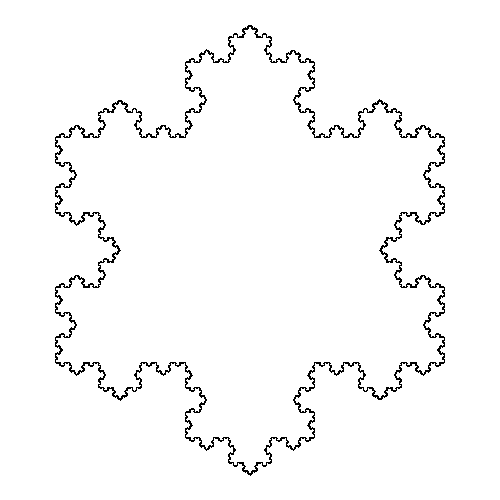
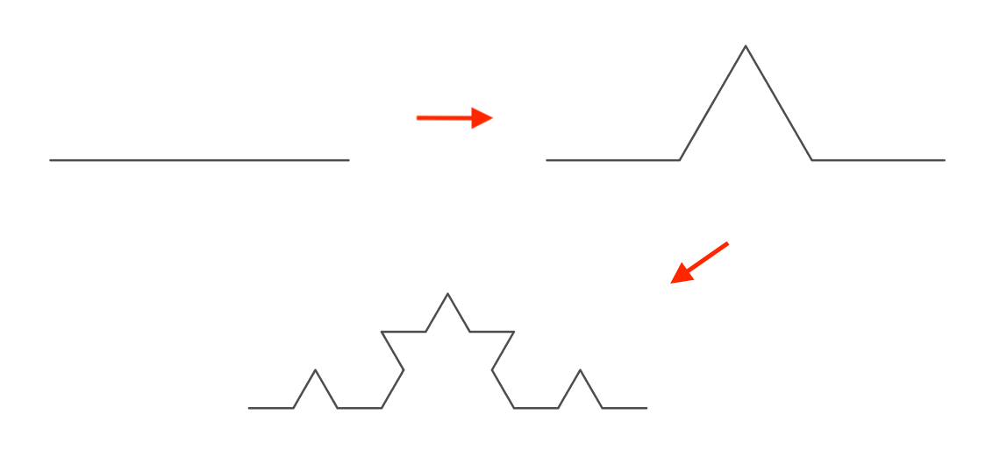
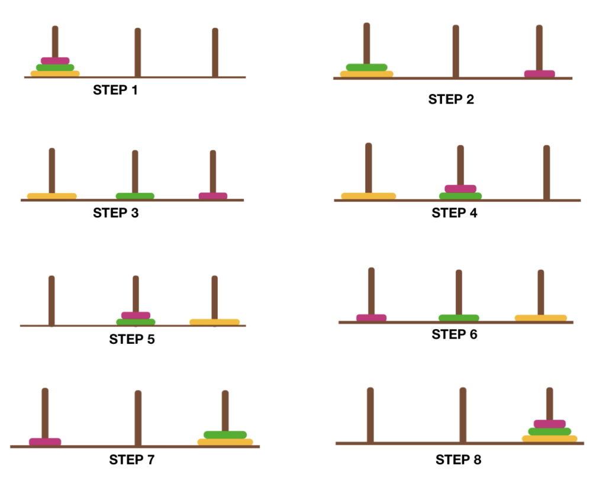

1. Écrire une fonction nommée `unique()` qui reçoit une liste en paramètre et qui renvoie une nouvelle liste contenant une fois chaque élément de la liste d'entrée, dans l'ordre d'apparition de la 1ère occurrence.

1. Écrire une fonction nommée `zipper()` qui reçoit 2 listes en paramètres et qui renvoie une liste contenant les éléments des deux listes alternés. Attention, les deux listes peuvent être de tailles différentes.

1. Écrire une fonction nommée `fibo()` qui prend un entier `n` en paramètre et qui renvoie le `n`<sup>ième</sup> terme de la suite de Fibonacci. La suite de Fibonacci est une suite où chaque terme est égal à la somme des deux termes précédents. Les deux premiers termes sont égaux à 1. Les termes sont numérotés à partir de 1.

1. Écrire une fonction nommée `pgcd()` qui prend deux entiers en paramètres et renvoie le "Plus Grand Commun Diviseur". Le PGCD peut être calculé en utilisant les relations suivantes: $$ "pgcd"(a, b) = cases( a &"si" b = 0, "pgcd"(b, a % b) &"sinon") $$

1. Écrire un programme qui affiche la figure suivante&nbsp;:

    

    Cette figure est composée de trois courbes construites selon le principe suivant&nbsp;:

    

    Vous pouvez utiliser <code>turtle</code> ou <code>pygame</code>.

1. Écrire un programme qui résout le problème des Tours de Hanoï.

    

    Le problème consiste en trois poteaux (A, B et C) et un certain nombre de disques de différentes tailles, empilés par ordre décroissant de taille sur le poteau A. L'objectif est de déplacer tous les disques du poteau A vers le poteau C, en suivant les règles suivantes :

    - Vous ne pouvez déplacer qu'un disque à la fois.
    - Un disque ne peut être placé que sur un autre disque plus grand ou sur un poteau vide.

    Votre programme doit demander le nombre de disques à déplacer `n` et afficher la séquence de mouvements nécessaires pour résoudre le problème, en respectant les règles ci-dessus.

    Votre programme doit afficher chaque mouvement sous la forme "Déplacez un disque de A vers C".

    Exemple de sortie pour `n = 3`&nbsp;:

    ```terminal
    Déplacez un disque de A vers C
    Déplacez un disque de A vers B
    Déplacez un disque de C vers B
    Déplacez un disque de A vers C
    Déplacez un disque de B vers A
    Déplacez un disque de B vers C
    Déplacez un disque de A vers C
    ```

    Ce qui correspond aux étapes suivantes&nbsp;:

    