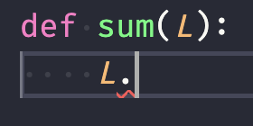
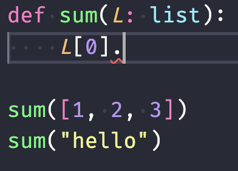
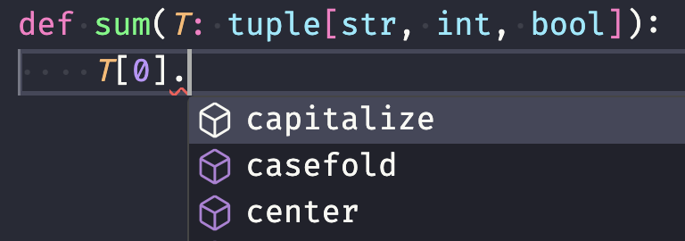
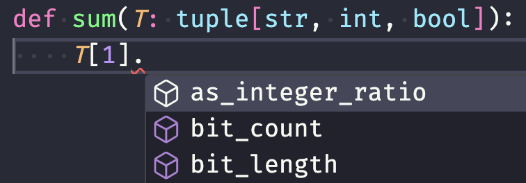
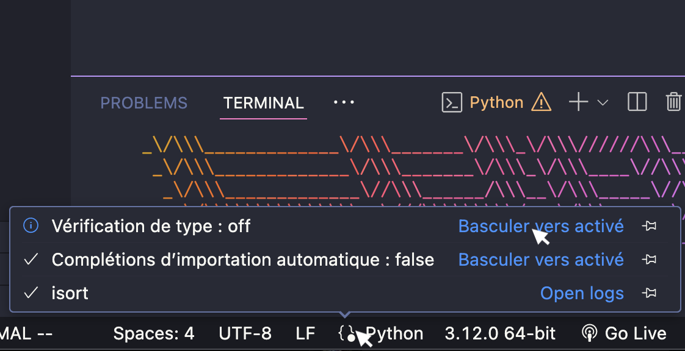
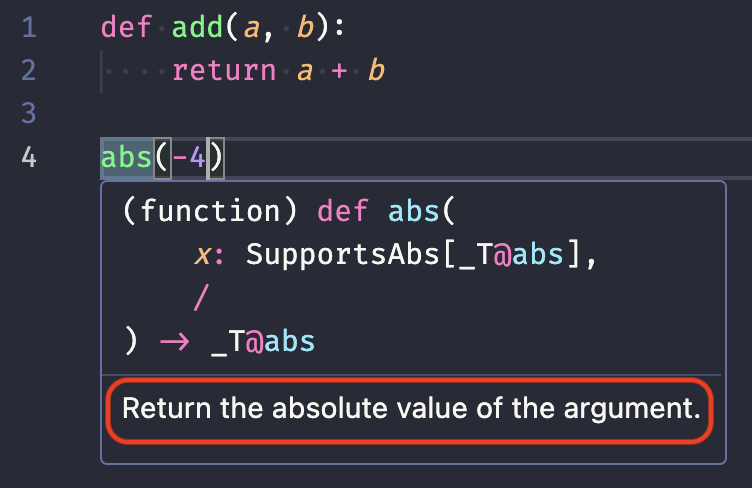

## Ensembles

- Collection **non ordonnée** d'éléments **distincts** [Pas de doublons et pas d'ordre entre les éléments]{.small}
- **Définition** d'un ensemble non vide avec **`{}`** <small>Opérations des séquences (sauf modification) applicables</small>

```python
numbers = {42, -2, 0, 7, 11}

print(numbers)            # {0, 42, 11, -2, 7}
print(len(numbers))       # 5
print(60 in numbers)      # False
print(type(numbers))      # <class 'set'>

for element in numbers:
	print(element)
```

## Définition

- Par **compréhension** ou à partir d'une **séquence** <small>Élimination automatique des doublons</small>
- Ensemble **vide** créé avec **`set()`**

```python
# {0, 42, 84, 21, 63}
S = {n for n in range(100) if n % 3 == 0 and n % 7 == 0}

# {0, 42, 12, -1}
A = set([12, 42, 0, 12, 0, -1, 0])

# {'!', 'C', 'i', 'c', 'o', 'r'}
B = set('Cocorico!')
```

$$ S = { n in NN "avec" 0 <= n < 100 | n "est divisible par" 3 "et" 7 } $$

## Modification d'un ensemble

- **Modification** d'un ensemble par ajout/suppression d'éléments <small>Utilisation des méthodes `add` et `remove`</small>

```python
S = {1, 2, 3, 4}

S.remove(1)               # {2, 3, 4}
S.remove(2)               # {3, 4}
S.add(5)                  # {3, 4, 5}
```

## Opérations ensemblistes

- Trois **opérations ensemblistes** de base
- Ces opérateurs créent tous des **nouveaux ensembles**

{width=25em}

```python
A = {1, 2, 3, 4}
B = {3, 4, 5}

print(A - B)              # {1, 2}            (différence)
print(A & B)              # {3, 4}            (intersection)
print(A | B)              # {1, 2, 3, 4, 5}   (union)
```

## Éléments d'un ensemble

- Les éléments d'un ensemble doivent être **uniques** <small>Par conséquent, ils doivent être non modifiables</small>
- On ne peut pas créer un **ensemble d'ensembles**

```python
# L'ensemble des sous-ensembles de {1, 2, 3}
A = {{}, {1}, {2}, {3}, {1, 2}, {1, 3}, {2, 3}, {1, 2, 3}}
```

```terminal
Traceback (most recent call last):
File "<stdin>", line 1, in <module>
	TypeError: unhashable type: 'set'
```

## Le type `frozenset`

- Le type `frozenset` représente un **ensemble non modifiable** <small>Les opérations des ensembles (sauf modification) sont applicables</small>
- On peut créer un **ensemble d'ensembles non modifiables** <small>Un `set` dont les éléments sont des `frozenset`</small>

```python
# L'ensemble des sous-ensembles de {1, 2, 3}
A = {
	frozenset(),
	frozenset({1}), frozenset({2}), frozenset({3}),
	frozenset({1, 2}), frozenset({1, 3}), frozenset({2, 3}),
	frozenset({1, 2, 3})
}
```

## Somme des éléments d'un ensemble {.code}

```python
S = {1, 2, 3}

# avec un for
def sumElements(S):
	sum = 0
	for elem in S:
		sum += elem
	return sum

print(sumElements(S))    # 6

# avec la fonction sum
print(sum(S))            # 6
```

## Plus grande valeur d'un ensemble {.code}

```python
S = {1, 24, -2, 99, 16}

# avec un for
def maxElement(S):
	max = float("-inf")
	for elem in S:
		if elem > max:
			max = elem
	return max

print(maxElement(S))            # 99

# avec la fonction max
print(max(S))                   # 99
```

## Dictionnaire

- Ensemble de **paires clé-valeur** <small>Les clés sont uniques et non modifiables</small>
- **Définition** d'un dictionnaire avec **`{}`** <small>Opérations des séquences (sauf indices) applicables</small>

```python
phone = {'Quentin': 8723, 'Cédric': 2837, 'Nathalie': 4872}

print(phone)              # {'Quentin': 8723, 'Cédric': 2837,
                          #  'Nathalie': 4872}
print(len(phone))         # 3
print('Cédric' in phone)  # True
print(type(phone))        # <class 'dict'>
```

## Définition

- Par **compréhension** ou à partir d'une **liste de paires** clé-valeur <small>Élimination automatique des doublons</small>
- **Dictionnaire vide** avec `{}` <small>Attention à ne pas confondre avec l'ensemble vide</small>

```python
# {1: 1, 3: 9, 9: 81, 5: 25, 7: 49}
square = {n : n ** 2 for n in range(1,10) if n % 2 != 0}

# {'A': 65, 'C': 67, 'B': 66, 'E': 69, 'D': 68, 'F': 70}
mapping = {chr(i): i for i in range(65, 71)}
```

## Accès et modification

- **Accès à une valeur** à l'aide de la clé entre crochets <small>Permet également la modification d'une valeur</small>
- **Suppression** paire clé-valeur avec la fonction `del`
- Deux situations si la **clé n'existe pas**
  - À droite de `=` : provoque une erreur _(accès)_
  - À gauche de `=` : ajoute une paire clé-valeur au dictionnaire _(assignation)_

```python
price = {"lemon": 0.85, "pear": 1}

price['lemon'] = 0.90     # {"lemon": 0.90, "pear": 1}
price['apple'] = 1.00     # {"lemon": 0.90, "pear": 1, "apple": 1}
del(price['pear'])        # {"lemon": 0.90, "apple": 1}
```

## Parcours d'un dictionnaire

- Accès aux clés avec la méthode `keys()`, aux paires avec `items()` et aux valeurs avec la méthode `values()` <small>Renvoient de séquences que l'on peut convertir en liste</small>

```python

print(list(price.keys()))  # ['lemon', 'pear', 'apple']
print(list(price.items())) # [('lemon', 0.9), ('pear', 1.0), ('apple', 1.0)]
print(list(price.values()))# [0.9, 1.0, 1.0]

# Parcours des clés explicite
for fruit in price.keys():
	print(fruit, price[fruit], sep=' : ')

# Parcours des clés implicite
for fruit in price:
	print(fruit, price[fruit], sep=' : ')

# Parcours des clés et valeurs
for key, value in price.items():
	print(key, value, sep=' : ')

# Parcours des valeurs seulement
for value in price.values():
	print(value)
```

## Collection et recherche

- Une collection est une **structure de données** permettant de **stocker** et d'**organiser** des **valeurs** <small>Liste, Tuples, Ensembles, Dictionnaires</small>
- La **recherche** d'un élément se fait avec l'opérateur `in`
- Chaque type de collection est **optimisé différemment** vis-à-vis des recherches :
  - Liste et tuple : complexité $O(n)$
  - Ensembles et dictionnaires : complexité $O(1)$

## Complexité

- La complexité caractérise le temps d'exécution ou la quantité de mémoire utilisée d'un algorithme **par rapport à la taille du problème** ($n$) à résoudre.
- Exemples:
  - taille du problème double $=>$ temps d'exécution double : **complexité temporelle linéaire** (notation : **"grand O de n"**, $O(n)$)
  - taille du problème double $=>$ utilisation mémoire quadruple : **complexité spatiale quadratique** ($O(n^2)$)
  - temps d'exécution indépendant de la taille du problème : **complexité temporelle constante** ($O(1)$)

## À chaque collection son usage

- Choix de la structure de données utilisée **en fonction des besoins** :
  - Listes: Ordonnée, modifiable
  - Tuples: Ordonné, immuable
  - Ensemble: Recherche en temps constant
  - Dictionnaire: Recherche par clé en temps constant

## Exemple {.code}

```python
# Stockage d'informations d'étudiants avec recherche par matricule efficace
students = {
  "11111": {"firstname": "Peter", "lastname": "Parker"},
  "11112": {"firstname": "Sarah", "lastname": "Connor"},
}

# Stockage d'informations d'étudiants avec importance de l'ordre
students = [
  {"matricule": "11111", "firstname": "Peter", "lastname": "Parker"},
  {"matricule": "11112", "firstname": "Sarah", "lastname": "Connor"},
]
```

## Annotations de type: problème

- L'éditeur _(VSCode)_ nous aide mais pas tout le temps

:::row
:::span6

{width=8em}

:::
:::{.span6 .middle}

{width=5em}

:::
:::

## Annotations de type

- Le type de `L` est inconnu $=>$ pas d'aide

{width=8em}

- Ajout d'annotation pour aider l'éditeur

{width=8em}

## Listes

- Une collection peu contenir n'importe quoi

{width=8em}

{width=14em}

## Tuples

- Tuples de taille fixe, on spécifie le type de chacun des éléments

:::row
:::span6

:::
:::span6

:::
:::

- Tuples de taille variable, on utilise un type et une ellipse

```python
def sum(T: tuple[int, ...]):
  ...
```

## Dictionnaires

- Le type des clés peut être spécifié

```python
def fun(D: dict[str, int]):
  D['un'] = 1
```

- Les clés d'un dictionnaire doivent être non-modifiable (`Hashable`)

```python
from typing import Hashable, Any

def add_key_value(D: dict, k: Hashable, v: Any):
  D[k] = v
```

- Le type `Any` accepte n'importe quoi.

## Unions

- Si plusieurs types doivent être acceptés

```python
def sum(x: str | bool):
  ...
```

## Options

- Si `None` est accepté

```python
from typing import Optional

def sum(x: Optional[int]):
  ...
```

- Équivalent à

```python
def sum(x: int | None):
  ...
```

## Types de retour

- On peut aussi spécifier le type de retour

```python
def sum(L: list[int]) -> int:
  res = 0
  for elem in L:
    res += elem
  return res

```

## Vérification de type

- L'éditeur peut aussi vérifier qu'on respecte bien les types



## Documentation

- Les fonctions prédéfinies ont une documentation intégrée que l'éditeur peut afficher



- Ce texte de documentation s'appelle le `docstring`

## Docstring

- Dans vos fonctions, vous pouvez définir le `docstring` en début de fonction avec des triples `'` ou `"`


