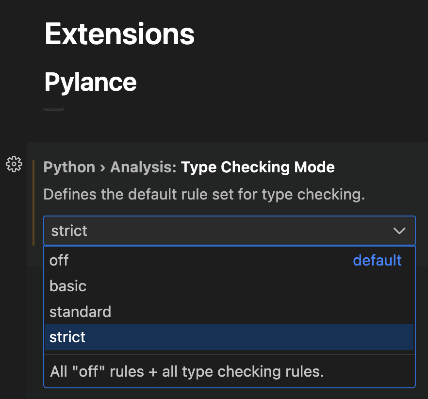

## Annotations de types

Activez la vérification de types dans **Visual Studio Code** (ou dans tout autre éditeur que vous utiliseriez).

{.half}

## Ensemble et dictionnaires

1.  Définir un ensemble qui contient:
    a. les caractères utilisés dans la phrase
    `"Je suis un as en programmation."`,
    b. les naturels compris entre 1 et 1000 (inclus) qui sont
    divisibles par 3 et 13,
    c. les voyelles qui sont utilisées dans la phrase
    `"Maitriser les listes est crucial!"`.
2.  Définir une fonction `def set2list(A: set) -> list` qui convertit
    l\'ensemble `A` en une liste qui contient exactement
    les mêmes éléments, sans utiliser la fonction `list`.
3.  Définir une fonction `def common(A: set, B: set) -> int` qui renvoie le
    nombre d\'éléments qu\'il y a en commun entre les deux ensembles
    `A` et `B`, de deux façons différentes :
    1.  à l\'aide d\'une boucle `for` et de l\'opérateur
        `in`,
    2.  à l\'aide d\'un opérateur ensembliste.
4.  Définir une fonction `def xor(A:set , B: set) -> set` qui renvoie
    l\'union exclusive des ensembles `A` et
    `B`, c\'est-à-dire l\'ensemble des éléments qui se
    trouvent dans l\'ensemble `A` ou dans l\'ensemble
    `B`, mais pas dans les deux en même temps.
5.  Définir un dictionnaire qui contient :
    a. les dix premiers entiers pairs de 2 à 20 (inclus), comme clés,
    et la valeur de la clé moins un comme valeur,
    b. les dix premiers entiers de la forme `2n + 1`,
    pour `n` compris entre 1 et 10 (inclus), comme
    clés, et `True` ou `False` comme
    valeur selon que la clé est divisible par trois ou non,
    c. les mots de la liste
    `['lemon', 'apple', 'banana', 'watermelon']` comme
    clé, et le nombre de voyelles que chaque mot contient comme
    valeur (vous devriez sans doute préalablement définir une
    fonction qui compte le nombre de voyelles présentes dans un
    mot).
6.  Définir une fonction `def hasKey(key: Hashable, dico: dict) -> bool` qui
    renvoie True si la clé key existe dans le dictionnaire et False
    sinon, de deux façons différentes :
    a. à l\'aide d\'une boucle `for`
    b. à l\'aide de l\'opérateur `in`

## Réflexion

Afin de déterminer quels types de soupes acheter pour ses employés, le
directeur d\'une entreprise propose à chacun de ses employés de voter
parmi les choix possibles proposés par son fournisseur en soupes. Les
votes des employés sont stockés dans une liste. Le directeur désire
identifier la soupe qui a remporté le plus grand nombre de votes, et
vous demande pour cela de définir les deux fonctions suivantes :

- `def computeFreq(votes: list[str]) -> dict[str, int]` permet de construire un
  dictionnaire à partir de la liste des votes, représentant le tableau
  des fréquences des votes,
- `def maxFreq(frequencies: dict[str, int]) -> int` renvoie la soupe qui a
  obtenu le plus grand nombre de votes (ou une des soupes si plusieurs
  ont obtenu le plus grand nombre de votes).

```python
votes = [
  "tomate",
  "cerfeuil",
  "tomate",
  "potiron",
  "tomate",
  "cerfeuil",
  "poulet"
]
frequencies = computeFreq(votes)
soup = maxFreq(frequencies)
print(f"La soupe la plus populaire est {soup} avec {frequencies[soup]} votes.")
```

```terminal
La soupe la plus populaire est tomate avec 3 votes.
```
